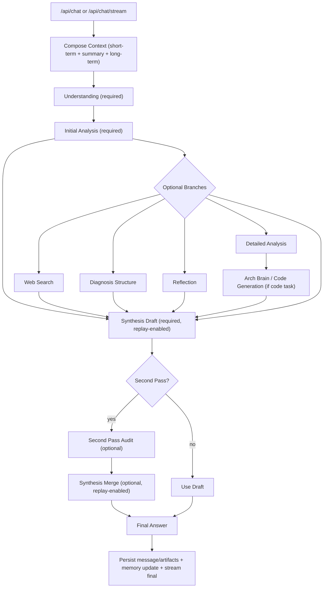

# Agent Pipeline Contract Profile

## 1. Scope

This specification defines the public stage contract for the runtime pipeline.
It standardizes stage order, stage I/O, transition rules, and user-surface emission gates.
The pipeline is the execution form of the `Two-Stage Contract-Driven Delivery` pattern in IAR.

Out of scope:

- private prompt composition internals
- provider-specific API payload internals
- non-public deployment hooks

## 2. Problem Statement

Without a formal stage profile, pipeline behavior drifts across sync/stream paths.
Typical failures:

- stage reordering that breaks diagnosis validity
- inconsistent timeout handling between optional and required steps
- user-surface leakage from internal stages
- second-pass behavior ambiguity in auto mode

## 3. Contract / Data Model

### 3.1 Stage Contract

| Field | Type | Meaning |
| --- | --- | --- |
| `stage_id` | string | stable stage key |
| `required` | boolean | required or optional stage |
| `timeout_ms` | integer | stage timeout budget |
| `input_keys` | array[string] | required input state keys |
| `output_keys` | array[string] | output state keys |
| `on_timeout_event` | string | transition event on timeout |
| `failure_class` | string | failure class for terminal timeout |

### 3.2 Baseline Stage Order

1. `understand` (required)
2. `initial_analysis` (required)
3. `diagnosis_structure` (optional by route)
4. `reflection` (optional)
5. `synthesis_draft` (required)
6. `second_pass` (optional by policy)
7. `synthesis_finalize` (required)
8. `render` (required)

Routing note tied to current runtime behavior:

- when `interaction_mode=KNOWLEDGE`, `domain=general`, and `initial_analysis` is non-empty, route to `reflection` before synthesis

### 3.3 User-Surface Emission Gate

Before first user-visible content chunk:

`mode_selected -> language_locked -> style_mode_locked`

User-visible body stream allows source whitelist:

- allowed: `answer`, `quote`
- blocked: `tool`, `audit`, `plan`, `debug`, `status`, `artifact`

Output Contract Gate v3.0 invariants:

- single writer: only `synthesis_finalize` can commit final answer text
- second-pass is `signals-only`: never stream raw audit text to user body
- final consistency: `final.content == final_answer_text == persisted_answer`

Streaming visibility gate:

- `initial_analysis` streaming deltas are internal and must not be forwarded to user body
- user body stream only forwards content phases: `draft_delta | answer_delta | quote_delta`
- `final_delta` and any non-allowlisted phase must be dropped from user body stream

### 3.4 End-to-End Pipeline Flow


Reference diagram exported from the current runtime flow for external readers.
The Mermaid block below is kept as a text-diff baseline for review and version control.



## 4. Decision Logic

```python
def run_pipeline(state, stage_specs):
    emit_status("mode_selected")
    emit_status("language_locked")
    emit_status("style_mode_locked")

    for spec in stage_specs:
        if spec.optional and should_skip_optional(spec.stage_id, state):
            apply_transition("on_optional_step_timeout")
            continue

        result = run_stage_with_timeout(spec, state)

        if result.timeout and spec.required:
            set_failure("systemic_failure", spec.stage_id, "required_step_timeout")
            return finalize_failure(state)

        if result.timeout and not spec.required:
            set_failure("retryable_failure", spec.stage_id, "optional_step_timeout")
            apply_transition(spec.on_timeout_event)
            continue

        state = merge_stage_output(state, result.output)

    return finalize_success(state)
```

## 5. Failure and Degradation

1. required stage timeout -> terminal path for current run branch
2. optional stage timeout -> skip with retryable classification
3. second-pass in `auto` mode -> `confirm_second_pass` action instead of auto execution
4. untrusted second-pass output -> keep draft answer and suppress audit text from body stream
5. non-allowlisted content phase in stream -> drop delta and continue run
6. synthesis merge causes semantic shrink -> invariant gate reverts to draft answer
7. template/noise leakage in synthesis text -> quarantine raw fragment and keep sanitized body
8. dangling tail (`->`, `→`, unfinished punctuation) -> tail-completion guard repairs terminal sentence

## 6. Acceptance Scenarios

1. Standard path with second pass disabled:
   - Expected: ordered execution and direct finalize.
2. Optional reflection timeout:
   - Expected: transition `skip_optional_step`; run continues.
3. Required synthesis finalize timeout:
   - Expected: classified as `systemic_failure`; current branch terminates.
4. Auto second-pass mode in normal chat:
   - Expected: `next_action=confirm_second_pass`; no second-pass execution.
5. Second-pass-only mode with auto setting:
   - Expected: second pass executes without confirmation pause.
6. Internal source leak attempt (`audit_delta`):
   - Expected: chunk blocked from user-visible body.
7. `initial_analysis` streaming emits internal deltas:
   - Expected: captured for internal state only; not forwarded to user stream.
8. `interaction_mode=KNOWLEDGE` with `domain=general`:
   - Expected: route goes to `reflection` before synthesis.
9. Merge output drops key engineering anchors:
   - Expected: invariant gate fallback to draft (`fallback=draft`).
10. Detailed explanation contains template residue:
   - Expected: noisy fragment removed from body and moved to quarantine fold.
11. Final sentence ends with dangling continuation marker:
   - Expected: tail-completion guard outputs a complete terminal sentence.

## 7. Compatibility and Versioning

- Stage IDs and stage order are stable in minor releases.
- New optional stages may be added in minor releases with explicit defaults.
- Reordering baseline required stages is a major contract change.
- Emission gate changes require synchronized updates to SSE and UI stream contract docs.

## 8. Cross References

- [Runtime Design Philosophy](./runtime-design-philosophy.md)
- [SSE Response Contract](./sse-response-contract.md)
- [Second-Pass Audit Merge Policy](./second-pass-audit-merge-policy.md)
- [Runtime Reliability Mechanisms](./runtime-reliability-mechanisms.md)
