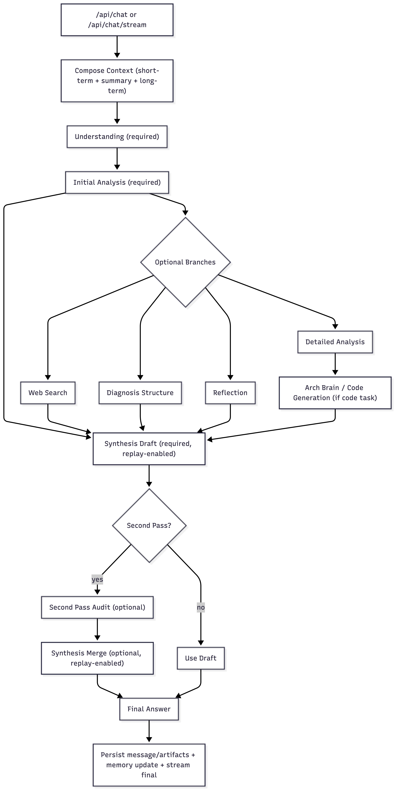
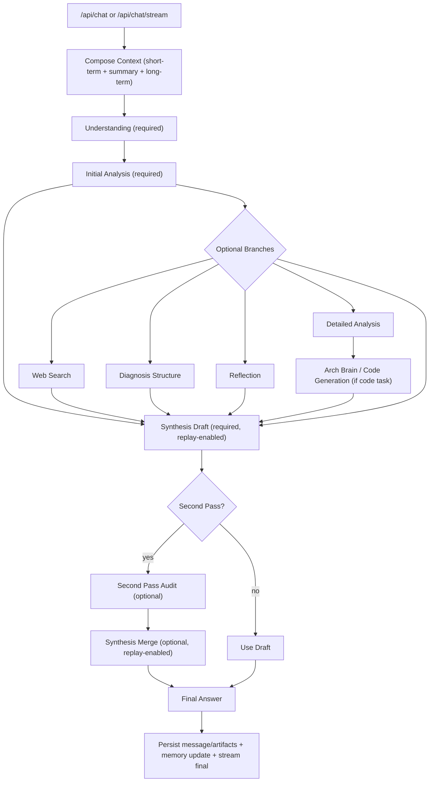

# Agent Pipeline 契约 Profile

## 1. 范围

本文定义 runtime pipeline 的公开阶段契约。
用于统一阶段顺序、阶段输入输出、转移规则与用户面发射门禁。
该 pipeline 是 IAR 中 `Two-Stage Contract-Driven Delivery`（双阶段契约驱动交付模式）的执行形态。

不在范围内：

- 私有 prompt 组合细节
- 模型供应商专有 API 负载细节
- 非公开部署钩子

## 2. 问题定义

若缺少正式阶段 profile，sync/stream 路径会出现行为漂移。
典型失败：

- 阶段重排导致诊断失真
- optional/required timeout 处理不一致
- 内部阶段内容泄漏到用户正文
- auto 模式下 second-pass 行为不明确

## 3. 契约 / 数据模型

### 3.1 阶段契约

| 字段 | 类型 | 含义 |
| --- | --- | --- |
| `stage_id` | string | 稳定阶段标识 |
| `required` | boolean | 必选或可选阶段 |
| `timeout_ms` | integer | 阶段超时预算 |
| `input_keys` | array[string] | 所需输入 state 键 |
| `output_keys` | array[string] | 产出 state 键 |
| `on_timeout_event` | string | 超时触发的转移事件 |
| `failure_class` | string | 终止超时的失败分类 |

### 3.2 基线阶段顺序

1. `understand`（required）
2. `initial_analysis`（required）
3. `diagnosis_structure`（按路由可选）
4. `reflection`（可选）
5. `synthesis_draft`（required）
6. `second_pass`（按策略可选）
7. `synthesis_finalize`（required）
8. `render`（required）

与当前 runtime 对齐的路由说明：

- 当 `interaction_mode=KNOWLEDGE`、`domain=general` 且 `initial_analysis` 非空时，先进入 `reflection` 再进入 synthesis

### 3.3 用户面发射门禁

在首个用户可见 content 前必须先发：

`mode_selected -> language_locked -> style_mode_locked`

用户正文流 source 白名单：

- 允许：`answer`, `quote`
- 阻断：`tool`, `audit`, `plan`, `debug`, `status`, `artifact`

Output Contract Gate v3.0 不变量：

- 单写者：仅 `synthesis_finalize` 可提交最终答案文本
- second-pass 仅允许 `signals-only`：禁止原始审计文本进入用户正文流
- 终态一致性：`final.content == final_answer_text == persisted_answer`

流式可见性门禁：

- `initial_analysis` 的 streaming delta 属于内部信号，不进入用户正文
- 用户正文仅允许转发 phase：`draft_delta | answer_delta | quote_delta`
- `final_delta` 与其他非白名单 phase 必须丢弃

### 3.4 端到端 Pipeline 流程图



这张图与当前 runtime 行为对齐，给外部读者一个可快速核对的可视化入口。
下方 Mermaid 保留为文本基线，便于评审和版本 diff。



## 4. 决策逻辑

```python
def run_pipeline(state, stage_specs):
    emit_status("mode_selected")
    emit_status("language_locked")
    emit_status("style_mode_locked")

    for spec in stage_specs:
        if spec.optional and should_skip_optional(spec.stage_id, state):
            apply_transition("on_optional_step_timeout")
            continue

        result = run_stage_with_timeout(spec, state)

        if result.timeout and spec.required:
            set_failure("systemic_failure", spec.stage_id, "required_step_timeout")
            return finalize_failure(state)

        if result.timeout and not spec.required:
            set_failure("retryable_failure", spec.stage_id, "optional_step_timeout")
            apply_transition(spec.on_timeout_event)
            continue

        state = merge_stage_output(state, result.output)

    return finalize_success(state)
```

## 5. 失败与降级

1. required 阶段超时 -> 当前 run 分支终止
2. optional 阶段超时 -> retryable 分类并跳过
3. `auto` second-pass -> 返回 `confirm_second_pass`，不自动执行
4. second-pass 输出不可信 -> 保留 draft，且禁止 audit 文本进入用户正文
5. 流式分片 phase 不在白名单 -> 丢弃该分片，流程继续
6. synthesis merge 发生语义收缩 -> invariant gate 回退到 draft
7. synthesis 文本出现模板噪声泄漏 -> 隔离原始片段并保留清洗后的正文
8. 尾部出现悬空标记（`->`、`→`、未闭合标点）-> tail-completion guard 修复结尾句

## 6. 验收场景

1. second-pass 关闭的标准路径：
   - 预期：按序执行并直接 finalize。
2. optional reflection 超时：
   - 预期：触发 `skip_optional_step`，流程继续。
3. required synthesis finalize 超时：
   - 预期：分类为 `systemic_failure`，当前分支终止。
4. 普通对话中的 auto second-pass：
   - 预期：`next_action=confirm_second_pass`，不执行 second-pass。
5. second-pass-only + auto：
   - 预期：无需确认，直接执行 second-pass。
6. 内部 source 泄漏尝试（`audit_delta`）：
   - 预期：该分片不进入用户正文流。
7. `initial_analysis` 流式阶段产生内部分片：
   - 预期：仅用于内部状态，不转发到用户流。
8. `interaction_mode=KNOWLEDGE` 且 `domain=general`：
   - 预期：在 synthesis 前先走 `reflection`。
9. merge 输出丢失关键工程锚点：
   - 预期：invariant gate 回退为 draft（`fallback=draft`）。
10. 详细说明中包含模板残留：
   - 预期：噪声片段从正文移除，进入 quarantine 折叠区。
11. 最终句以悬空续写符结尾：
   - 预期：tail-completion guard 输出完整终句。

## 7. 兼容与版本

- 阶段 ID 与基线阶段顺序在 minor 版本保持稳定。
- minor 版本可新增 optional 阶段，但必须声明默认行为。
- 基线 required 阶段重排属于 major 变更。
- 发射门禁变更必须同步更新 SSE 与 UI stream 契约文档。

## 8. 交叉引用

- [Runtime 设计哲学](./runtime-design-philosophy.zh.md)
- [SSE 响应契约](./sse-response-contract.zh.md)
- [Second-Pass Audit 合并策略](./second-pass-audit-merge-policy.zh.md)
- [Runtime 可靠性机制](./runtime-reliability-mechanisms.zh.md)
