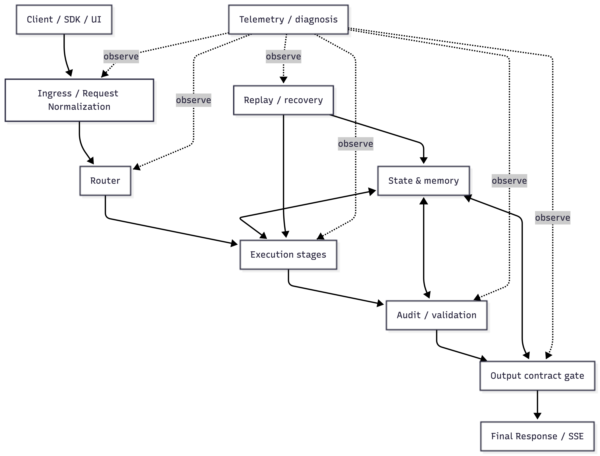
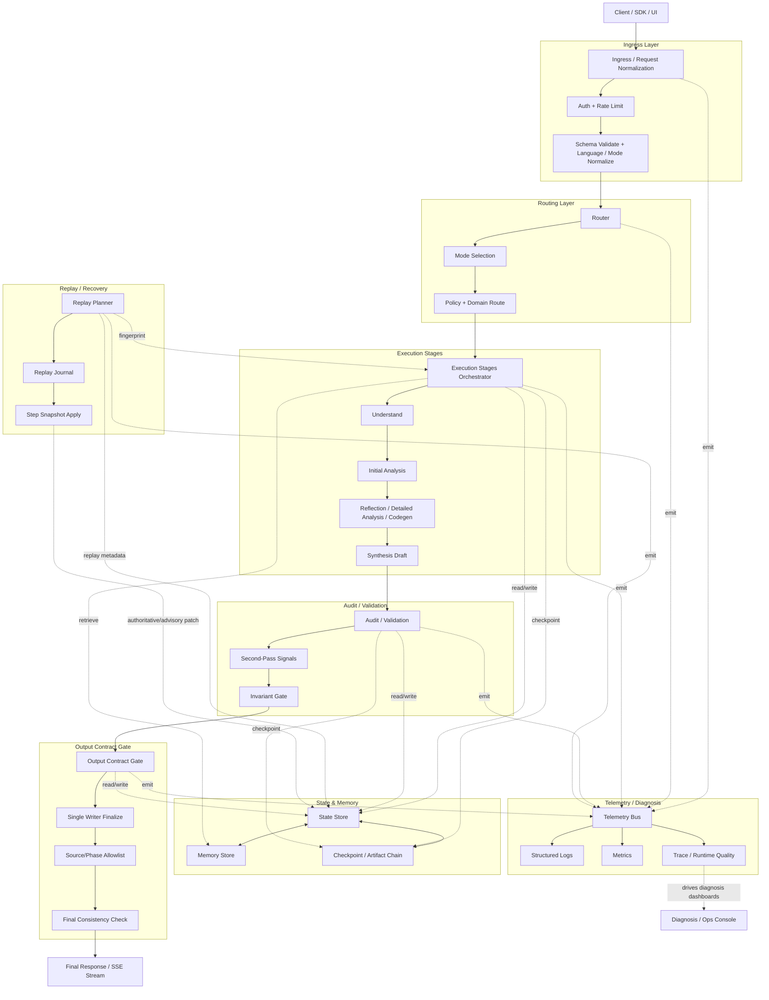

# Runtime Layered Architecture

This diagram focuses on runtime control-plane layering and ownership boundaries.

The image reflects the latest layered view; the Mermaid block stays as the text-auditable counterpart.

## Ownership Notes

- `Ingress / Router` owns request admission, normalization, and mode/domain routing.
- `Execution + Audit` owns content generation and correction signals.
- `Output Contract Gate` owns user-surface safety, single-writer finalize, and final consistency.
- `State & Memory + Replay` owns determinism, recovery, and traceable artifact history.
- `Telemetry / Diagnosis` owns observability contract and runtime diagnosis input.
