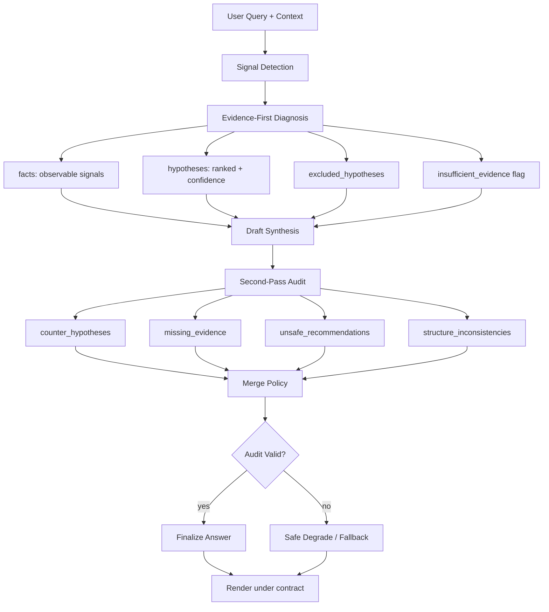

# Diagnosis Structure Flow

```mermaid
flowchart TD
    A["User Query + Context"] --> B["Signal Detection"]
    B --> C["Evidence-First Diagnosis"]
    C --> C1["facts: observable signals"]
    C --> C2["hypotheses: ranked + confidence"]
    C --> C3["excluded_hypotheses"]
    C --> C4["insufficient_evidence flag"]
    C1 --> D["Draft Synthesis"]
    C2 --> D
    C3 --> D
    C4 --> D
    D --> E["Second-Pass Audit"]
    E --> E1["counter_hypotheses"]
    E --> E2["missing_evidence"]
    E --> E3["unsafe_recommendations"]
    E --> E4["structure_inconsistencies"]
    E1 --> F["Merge Policy"]
    E2 --> F
    E3 --> F
    E4 --> F
    F --> G{"Audit Valid?"}
    G -- "yes" --> H["Finalize Answer"]
    G -- "no" --> I["Safe Degrade / Fallback"]
    H --> J["Render under contract"]
    I --> J
```

